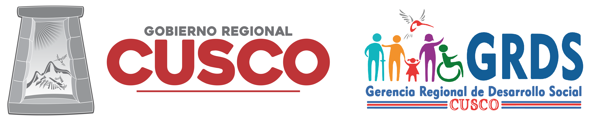

# Acerca de la ARDS

<!-- Dual columns -->

### La Agencia Regional de Desarrollo Social

La Agencia Regional de Desarrollo Social (ARDS) es un espacio de acción colectiva y vinculante en el que se discuten las políticas regionales en materia social, permite extender y mejorar los procedimientos de la Administración Pública. Está conformado por los sectores de Educación, Salud, Vivienda Construcción y Saneamiento, Trabajo y Promoción del Empleo y las Gerencias Territoriales, constituye una estrategia de gestión participativa en la cual se crean plataformas de debate y análisis de políticas regionales que promuevan el desarrollo integral del territorio con un enfoque intersectorial e intergubernamental.

***

### Marco Normativo de la ARDS

La Agencia Regional de Desarrollo Social es parte de la Agencia Regional de Desarrollo, contemplada en el artículo 57 del Reglamento de Organización y Funciones del Gobierno Regional Cusco, aprobada con Ordenanza Regional N° 176-2020-CR/GR CUSCO. El marco legal considera:

*	Constitución Política del Perú.
*	Ley N° 27680 de Reforma Constitucional.
*	Ley N° 27783 de bases de la descentralización.
*	Ley N° 27867 Ley Orgánica de Gobiernos Regionales
*	Ley N° 27902 Ley que modifica la Ley Orgánica de Gobiernos Regionales
*	Decreto Supremo N° 006-2017-JUS, Decreto Supremo que aprueba el texto Único Ordenado de la Ley N° 27444, Ley del Procedimiento Administrativo General, modificado con Decreto Legislativo N° 1272
*	Ordenanza Regional N° 176-2020-CR/GR CUSCO

***

### Integrantes de la ARDS

La ARDS está conformada por (5) directorios, los directorios son parte de la Asamblea General y comprende a los siguientes:

*	Directorio de Salud: Conformado por tres (03) representantes del Consejo Regional de Salud Cusco – CORESA.
*	Directorio de Educación: Conformado por tres (03) representantes del Consejo Participativo Regional de Educación – COPARE.
*	Directorio de Trabajo: Conformado por tres (03) representantes del Consejo Regional de Trabajo y Promoción del Empleo – CRTPE.
*	Directorio de Vivienda: Conformado por tres (03) representantes del Comité Regional de Saneamiento Básico - CORSAB
*	Directorio de Inclusión Social: Conformado por (01) representante de cada uno de los siguientes espacios de concertación:
  *	Consejo Regional de Juventudes – COREJU
  *	Consejo Regional de Niña, Niño y Adolescente – CORENNA
  *	Consejo Regional de la Mujer – COREMUJ
  *	Consejo Regional de Adulto Mayor – COREPAM
  *	Consejo Regional de Integración de las Personas con Discapacidad * COREDIS
  *	Consejo Regional de Comunidades y Rondas Campesinas – CORECRC

***

