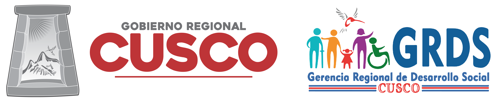

# El trabajo de la ARDS

<!-- Dual columns -->

### La Reestructuración del Gobierno Regional

El Gobierno Regional Cusco aprobó el nuevo Reglamento de Oranización y Funciones (ROF) con Ordenanza Regional N° 176-2020-CR/GRC CUSCO. El ROF aprobado se articula al marco normativo de la Modernización de la Gestión Pública, con el propósito de contribuir a construir un Estado democrático, descentralizado y al servicio de la sociedad civil. El ROF contribuye a tener un estado democrático, descentralizado y al servicio de la sociedad civil.

El ROF en su artículo 57 conforma la Agencia Regional de Desarrollo como un espacio de acción colectiva y vinculante, enfocada a mejorar y modernizar la Gestión Pública del Gobierno Regional.

### Consejos Regionales que conforman la ARDS

* Consejo Regional de Salud Cusco - CORESA.
Creado mediante Resolución Ejecutiva Regional N° 735-2003-GR CUSCO, con Resolución Ejecutiva Regional N° 846-2008-GR-CUSCO/PR se conformó el Comité Ejecutivo del CRS.
* Consejo Participativo Regional de Educación- COPARE.
Creado por la Ley N° 28044- Ley General de Educación, el Artículo 78 indica que el Consejo Participativo Regional de Educación es una instancia de participación, concertación y vigilancia en la elaboración, seguimiento y evaluación del Proyecto Educativo Regional. Está integrado por el Director Regional de Educación y representantes de docentes, universidades e Institutos Superiores, sectores económicos productivos, comunidades educativas locales e instituciones públicas y privadas de la región.
* Comité Regional de Saneamiento Básico - CORSAB.
Creado con Resolución Ejecutiva Regional N° 735-2006-GR CUSCO/PR como instancia técnica y organizacional para efectos de coordinación y concertación de los sectores y recursos del Sector Público, Privado, Organismos no Gubernamentales y Cooperación Internacional, involucrados en las actividades de Saneamiento Básico.
* Consejo Regional de Trabajo y Promoción del Empleo - CRTPE.
Creado mediante Ordenanza Regional N° 056-2009-CR/GRC.CUSCO con el objetivo de formentar el diálogo social, la concertación de políticas regionales en materia de trabajo, de promoción del empleo y de protección social; propiciando un clima adecuado para armonizar las relaciones laborales y mejorar la calidad de vida de los trabajadores, promoviendo el desempeño de una eficiente actividad empresarial, en el marco de las políticas nacionales y sectoriales.

***

